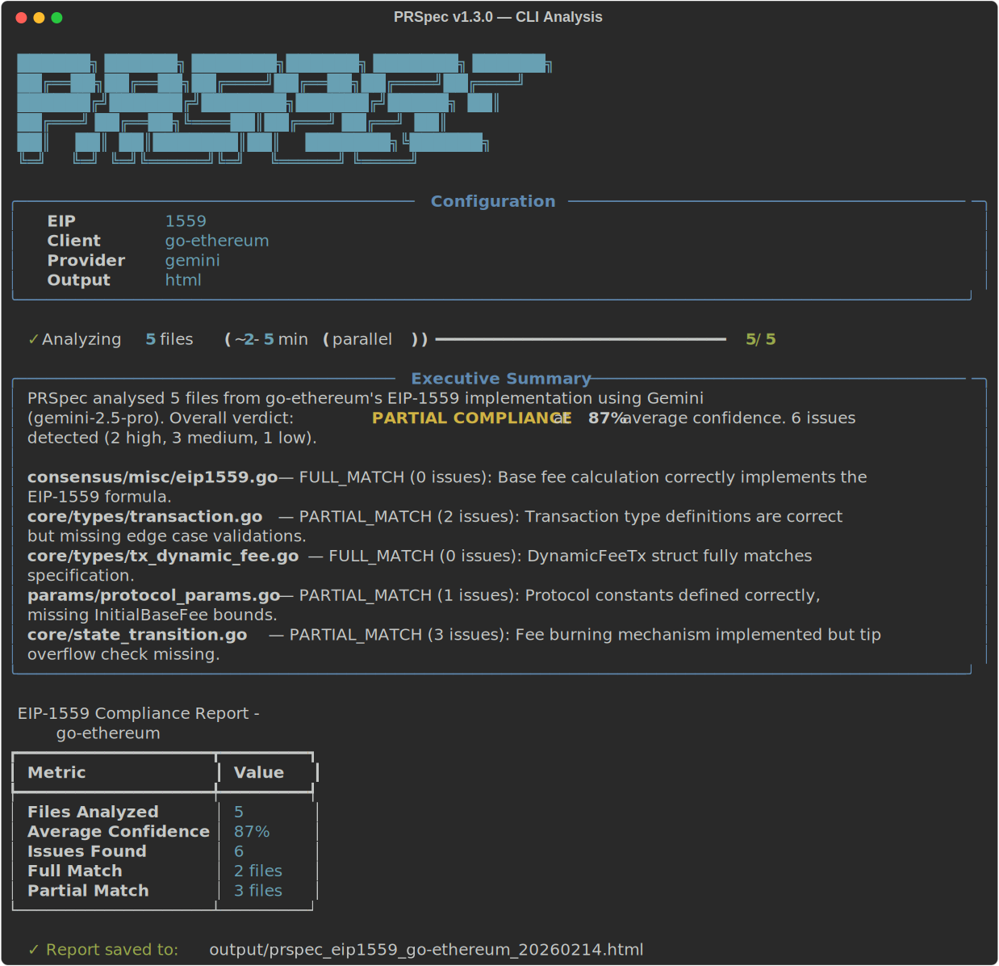
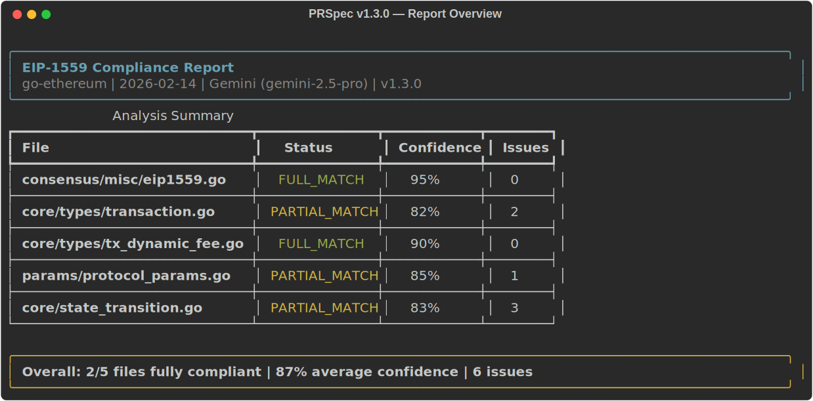
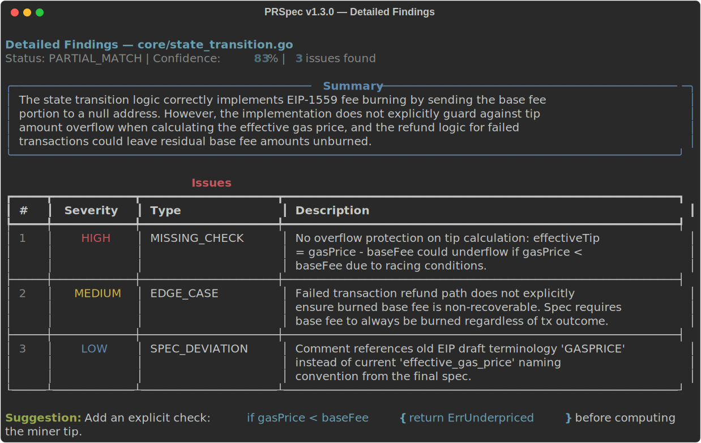
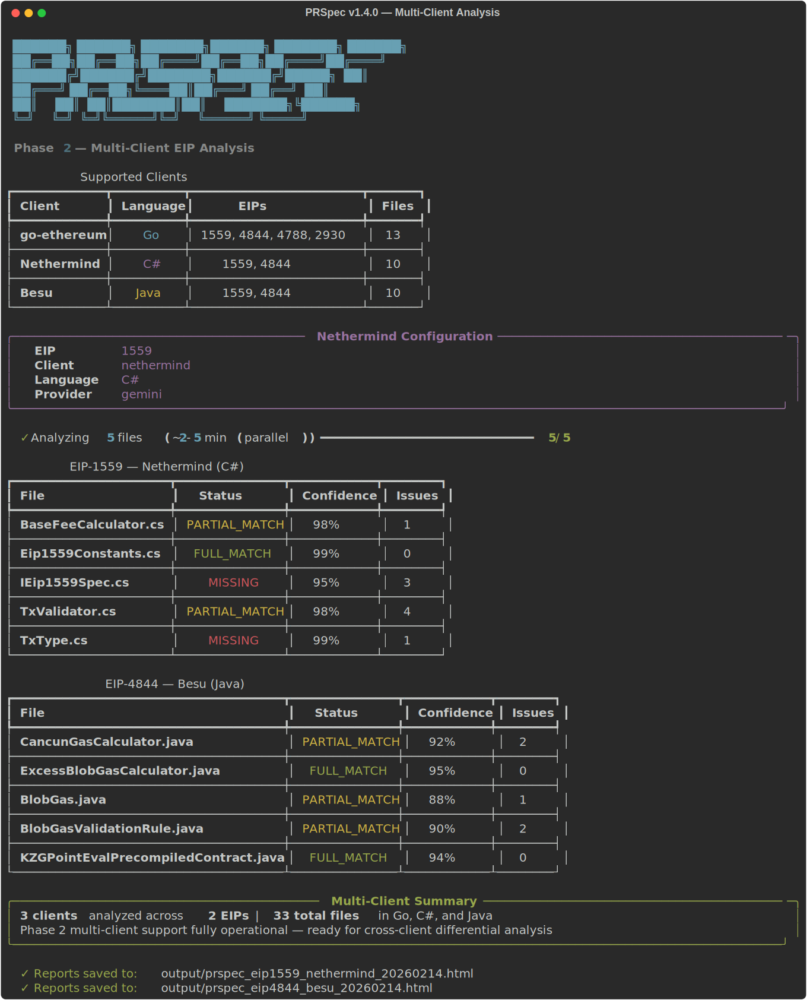

# PRSpec.

**Ethereum specification compliance checker:** Compares EIP specs against client source code using LLM analysis and AI.

[](https://www.python.org/downloads/)
[](LICENSE)
[](LICENSE)


PRSpec fetches official EIP documents (plus execution and consensus specs from the Ethereum repos), pulls the corresponding implementation files from multiple Ethereum clients (go-ethereum, Nethermind, Besu), and sends both to a large-context LLM (Gemini 2.5 Pro or GPT-4) to find deviations, missing checks, or edge cases.

> This project is being developed under the Ethereum Foundation ESP program for *Integrating LLMs into Ethereum Protocol Security Research*. See [GRANT_PROPOSAL.md](GRANT_PROPOSAL.md) for the full proposal.

<details>
<summary><b>Table of Contents</b></summary>

&nbsp;&nbsp;[Demo Video](#demo-video) · [Screenshots](#screenshots) · [Supported EIPs & Clients](#supported-eips--clients) · [Quick start](#quick-start) · [CLI usage](#cli-usage) · [Configuration](#configuration) · [Project layout](#project-layout) · [Example output](#example-output) · [Running tests](#running-tests) · [API usage](#api-usage) · [Contributing](#contributing) · [Changelog](#changelog) · [Roadmap](#roadmap)

</details>

---

## Screenshots

### CLI Analysis


### Report Overview


### Detailed Findings


### Multi-Client Analysis (Phase 2)


---

## Demo Video
### Video ▶️ [Watch on Youtube](https://www.youtube.com/watch?v=v7UtBAxigKc)
### Version 1.3 Terminal Video Demo ▶️ [Watch on ASCiinma](https://asciinema.org/a/FSqTk0tKOx8TFiQu)

---

## Supported EIPs & Clients

### Clients

| Client | Language | EIPs supported | Repo |
|--------|----------|---------------|------|
| go-ethereum | Go | 1559, 4844, 4788, 2930 | [ethereum/go-ethereum](https://github.com/ethereum/go-ethereum) |
| Nethermind | C# | 1559, 4844 | [NethermindEth/nethermind](https://github.com/NethermindEth/nethermind) |
| Besu | Java | 1559, 4844 | [hyperledger/besu](https://github.com/hyperledger/besu) |

### EIPs

| EIP | Title | Specs fetched | Files per client | Key focus areas |
|-----|-------|---------------|------------------|-----------------|
| 1559 | Fee market change | EIP + execution | geth 5 · nethermind 5 · besu 5 | base fee, gas limit, fee cap, state transition |
| 4844 | Shard Blob Transactions | EIP + execution + consensus | geth 5 · nethermind 5 · besu 5 | blob gas, KZG, max blobs, sidecar, tx pool |
| 4788 | Beacon block root in EVM | EIP + execution | geth 1 | beacon root |
| 2930 | Optional access lists | EIP + execution | geth 2 | access list validation |
| 7002 | Execution layer withdrawals | EIP + execution | — | withdrawal requests |
| 7251 | Increase MAX_EFFECTIVE_BALANCE | EIP + consensus | — | consolidation |

Run `python -m src.cli list-eips` to see the live registry.

---

## Quick start

```bash
# clone and set up
cd PRSpec
python -m venv venv && source venv/bin/activate
pip install -r requirements.txt

# add your API key
cp .env.example .env
# edit .env → GEMINI_API_KEY=your_key_here

# run the demo
python run_demo.py              # EIP-1559 by default
python run_demo.py --eip 4844   # EIP-4844
python run_demo.py --test       # quick API check
```

Get a Gemini key at https://makersuite.google.com/app/apikey

---

## CLI usage

```bash
# full analysis → produces JSON/Markdown/HTML reports
python -m src.cli analyze --eip 1559 --client go-ethereum --output html

# analyze Nethermind (C#) or Besu (Java) instead
python -m src.cli analyze --eip 1559 --client nethermind --output html
python -m src.cli analyze --eip 4844 --client besu --output html

# other commands
python -m src.cli fetch-spec --eip 4844
python -m src.cli list-files --client go-ethereum --eip 4844
python -m src.cli list-eips
python -m src.cli check-config
```

---

## Configuration

### config.yaml

```yaml
llm:
  provider: gemini

  gemini:
    model: gemini-2.5-pro
    max_output_tokens: 8192
    temperature: 0.1

  openai:
    model: gpt-4-turbo-preview
    max_tokens: 4096
    temperature: 0.1

eips:
  1559:
    focus_areas:
      - base_fee_calculation
      - gas_limit_validation
      - fee_cap_check
  4844:
    focus_areas:
      - blob_gas_price
      - kzg_commitment
      - max_blobs_per_block
      - sidecar_validation
```

### Environment variables

| Variable | Required | Description |
|----------|----------|-------------|
| `GEMINI_API_KEY` | Yes (Gemini) | Google API key |
| `OPENAI_API_KEY` | Yes (OpenAI) | OpenAI key |
| `GITHUB_TOKEN` | No | Higher GitHub rate limits |
| `LLM_PROVIDER` | No | Override default provider |

---

## Project layout

```
src/
  config.py            – YAML + env config loader
  spec_fetcher.py      – EIP registry, spec fetching (EIP/execution/consensus)
  code_fetcher.py      – Per-client per-EIP file registry, code fetching
  parser.py            – Go/Python/C#/Java parsing, EIP keyword matching
  analyzer.py          – Gemini / OpenAI analysis, JSON response parsing
  report_generator.py  – JSON, Markdown, HTML report output
  cli.py               – Click CLI
tests/
  test_eip1559.py
  test_eip4844.py
  test_multi_client.py – Nethermind/Besu registry + C#/Java parser tests
config.yaml
run_demo.py
```

---

## Example output

```json
{
  "status": "PARTIAL_MATCH",
  "confidence": 85,
  "issues": [
    {
      "type": "EDGE_CASE",
      "severity": "MEDIUM",
      "description": "Edge case when gas used equals target not explicitly handled",
      "suggestion": "Add explicit equality check"
    }
  ],
  "summary": "Implementation mostly compliant with minor edge case gaps."
}
```

Reports are written to the `output/` directory in all three formats.

---

## Running tests

```bash
python -m pytest tests/ -v

# with coverage
python -m pytest tests/ --cov=src
```

---

## API usage

```python
from src.config import Config
from src.analyzer import GeminiAnalyzer
from src.spec_fetcher import SpecFetcher
from src.code_fetcher import CodeFetcher

config = Config()
analyzer = GeminiAnalyzer(api_key=config.gemini_api_key)

spec_fetcher = SpecFetcher()
code_fetcher = CodeFetcher()

spec = spec_fetcher.fetch_eip_spec(4844)
files = code_fetcher.fetch_eip_implementation("go-ethereum", 4844)

result = analyzer.analyze_compliance(
    spec_text=spec["eip_markdown"],
    code_text=files["core/types/tx_blob.go"],
    context={"eip_number": 4844, "language": "go"},
)

print(result.status, result.confidence)
for issue in result.issues:
    print(f"  [{issue['severity']}] {issue['description']}")
```

---

## Contributing

Contributions are welcome! Please:
1. Fork the repository
2. Create a feature branch
3. Add tests for new functionality
4. Submit a pull request

---

## Changelog

### v1.4.0 (2026-02-14 ❤️)
- **Multi-client support**: Nethermind (C#) and Besu (Java) alongside go-ethereum (Go)
- EIP-1559 and EIP-4844 file mappings for all three clients (5 files each)
- C# and Java regex parsers with class + method extraction
- 25 new tests covering registry, parsers, and fetch integration
- Keyword matching verified language-agnostic (case-insensitive)

### v1.3.0 (2026-02-6)
- Parallel analysis — all files analyzed concurrently via thread pool, ~3x faster on multi-file EIPs
- Expanded file coverage: EIP-1559 and EIP-4844 now analyze 5 files each (added `state_transition.go`, `protocol_params.go`, `legacypool.go`)
- Beautified CLI: progress bar with file counter, styled config panel
- Migrated to `google-genai` SDK (replaces deprecated `google-generativeai`)
- Executive summary paragraph at the top of every report

### v1.1.0 (2026-02-01)
- Multi-EIP architecture: registry-based spec and code fetching
- Added EIP-4844, EIP-4788, EIP-2930 support
- HTML report with dark-nav professional layout
- Comprehensive test suite (37 tests)

### v1.0.0 (2026-01-22)
- Initial release: EIP-1559 analysis against go-ethereum
- Gemini and OpenAI support, JSON/Markdown/HTML output

---

## Roadmap

| Phase | Description | Status |
|-------|-------------|--------|
| 1 | Multi-EIP architecture, EIP-4844 support | Done |
| 2 | Multi-client analysis (Nethermind, Besu) | Done |
| 3 | Cross-client differential analysis | Next |
| 4 | Real-time monitoring and CI integration | Planned |

---

## License

MIT
