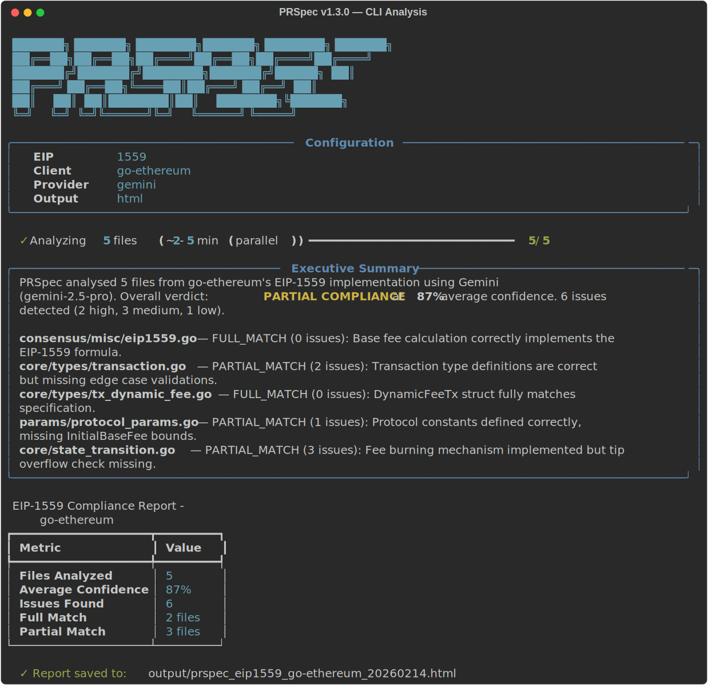
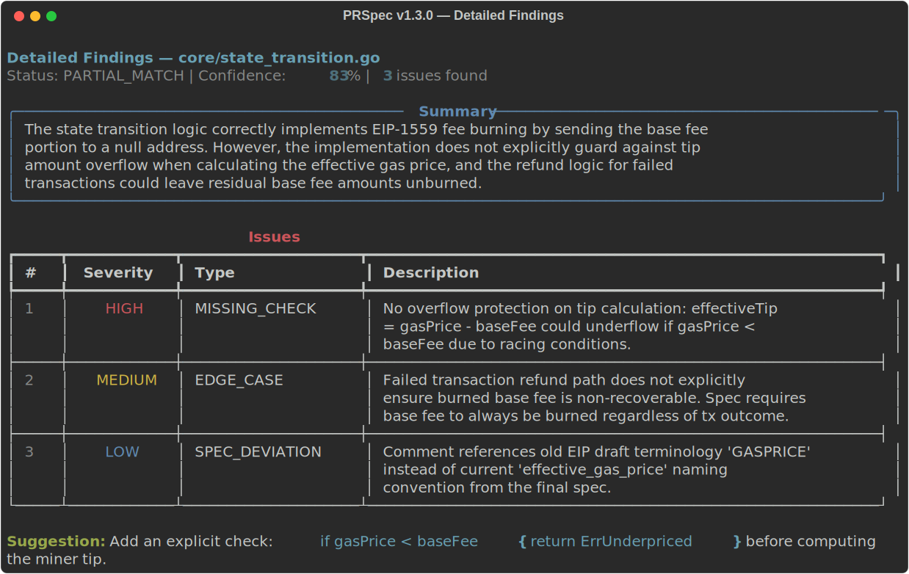
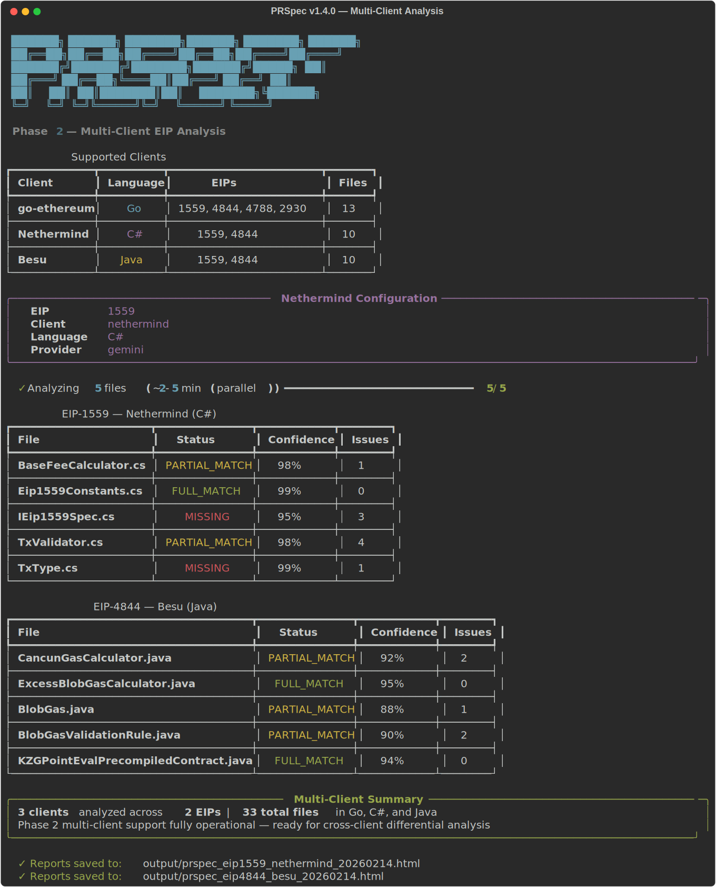

# PRSpec: Automated EIP Compliance & Protocol Security Research

**Bridging the gap between Ethereum Specifications and Client Implementations through Semantic LLM Analysis.**

[](https://www.python.org/downloads/)
[](LICENSE)
[](https://ai.google.dev/)
[](https://giveth.io/project/prspec-automated-eip-compliance-checker-for-ethereum)

---

## Strategic Value & Technical Differentiation

Unlike traditional static analysis tools (Linters/Static Analyzers) that only detect syntax errors, **PRSpec** addresses the **"Semantic Compliance Gap."** It understands the *intent* of an Ethereum Improvement Proposal (EIP) and verifies if the implementation logic across multiple languages actually follows the protocol's rules.

### Key Differentiators:
* **Semantic Analysis:** Goes beyond regex; it uses high-context LLMs to interpret complex English-language specs and compare them against multi-file codebase logic.
* **Cross-Client Verification:** Supports **go-ethereum (Go)**, **Nethermind (C#)**, and **Besu (Java)**, ensuring the "Single Source of Truth" (The Spec) is respected across the ecosystem.
* **Automated Spec Pipeline:** Directly fetches live specs from `ethereum/EIPs` and `ethereum/execution-specs` repos, eliminating manual documentation errors.

---

## Real-World Validation & Domain Expertise

PRSpec is not just a concept; it is a functional tool that has already contributed to the security of core Ethereum clients through direct developer engagement:

* **Nethermind (Issue #10522):** PRSpec identified a deviation in EIP-1559's `FeeCollector` implementation. A Nethermind core developer **confirmed the finding**, noting it as a chain-specific extension that requires better refactoring. ([View Discussion](https://github.com/NethermindEth/nethermind/issues/10522))
* **Ethereum Foundation (Issue #2212):** The **execution-specs** team provided architectural guidance on PRSpec’s spec extraction pipeline, validating the tool's methodology for protocol research. ([View Guidance](https://github.com/ethereum/execution-specs/issues/2212#issuecomment-3915461994))

---

## 📸 Screenshots & Demos

### CLI Analysis


### Detailed Findings


### Multi-Client Analysis (Phase 2)


---

## Demo Video
### Video ▶️ [Watch on Youtube](https://www.youtube.com/watch?v=v7UtBAxigKc)
### Version 1.3 Terminal Video Demo ▶️ [Watch on ASCiinma](https://asciinema.org/a/FSqTk0tKOx8TFiQu)

---

## Supported EIPs & Clients

PRSpec maintains a precise mapping between specs and implementation files to ensure high-fidelity results.

### Clients Coverage

| Client | Language | Stack | EIPs Supported |
|--------|----------|-------|----------------|
| **go-ethereum** | Go | Execution | 1559, 4844, 4788, 2930 |
| **Nethermind** | C# | Execution | 1559, 4844 |
| **Besu** | Java | Execution | 1559, 4844 |

### EIPs Coverage

| EIP | Title | Key Focus Areas |
|-----|-------|-----------------|
| **1559** | Fee market change | Base fee, gas limit, fee cap, state transition |
| **4844** | Shard Blob Transactions | Blob gas, KZG, max blobs, sidecar |
| **4788** | Beacon block root in EVM | Beacon root extraction |
| **2930** | Optional access lists | Access list validation logic |

---

## 🚀 Quick Start

```bash
# Clone and setup
git clone [https://github.com/Fosurero/PRSpec.git](https://github.com/Fosurero/PRSpec.git)
cd PRSpec
python -m venv venv && source venv/bin/activate
pip install -r requirements.txt

# Configuration
cp .env.example .env
# Edit .env → GEMINI_API_KEY=your_key_here

# Run Analysis
python -m src.cli analyze --eip 1559 --client go-ethereum --output html
```

## 🏗️ Project Architecture & Layout

PRSpec is built with a modular, "Engine-First" approach to ensure scalability and maintain high standards of code quality, addressing the precision required for security tooling.

```text
src/
  config.py            – YAML + env config loader
  spec_fetcher.py      – EIP registry, spec fetching (EIP/execution/consensus)
  code_fetcher.py      – Per-client per-EIP file registry, code fetching
  parser.py            – Go/Python/C#/Java parsing, EIP keyword matching
  analyzer.py          – Gemini / OpenAI analysis, JSON response parsing
  report_generator.py  – JSON, Markdown, HTML report output
  cli.py               – Click CLI
tests/
  test_eip1559.py
  test_eip4844.py
  test_multi_client.py – Nethermind/Besu registry + C#/Java parser tests
config.yaml
pyproject.toml         – Package metadata, dependencies, linter config
run_demo.py
```
### Core Components:

* **`spec_fetcher`**: Normalizes specs from official Ethereum repositories, ensuring analysis is always based on the latest protocol "Source of Truth."
* **`code_fetcher`**: Precisely targets and retrieves relevant logic from client repositories (**Geth, Nethermind, Besu**) to minimize noise and optimize LLM context.
* **`parser`**: Language-aware extraction of classes and methods using semantic markers, supporting **Go, C#, and Java** to ensure high-fidelity analysis across different stacks.
* **`analyzer`**: Orchestrates state-of-the-art LLM analysis (Gemini 2.5 Pro / GPT-4) to perform deep semantic audits between specifications and code.
* **`report_generator`**: Produces machine-readable (**JSON**) for CI/CD pipelines and human-readable (**HTML/MD**) audit logs for security researchers.


## Roadmap & Ecosystem Integration

| Phase | Status | Objective |
|:--- |:--- |:--- |
| **Phase 1** | ✅ Done | Multi-EIP architecture and initial **go-ethereum (Geth)** support. |
| **Phase 2** | ✅ Done | Multi-client expansion: Full implementation for **Nethermind (C#)** and **Besu (Java)**. |
| **Phase 3** | **Active** | **Cross-Client Differential Analysis**: Automated detection of logic divergence between different client implementations for the same EIP. |
| **Phase 4** | 📅 Planned | **GitHub Action CI Integration**: Automated compliance gating for Ethereum core repository pull requests (PRs). |
| **Phase 5** | 📅 Planned | **Spec Quality Analysis**: Using semantic logic to flag underspecified, ambiguous, or contradictory EIPs during the draft stage. |

## ❤️ Support This Public Good 💜

PRSpec is built entirely in the open and provided free under the MIT license. We believe cross-client spec compliance is a fundamental pillar of Ethereum's security. If you find this tool valuable for protocol research or client security, consider supporting continued development:

[](https://giveth.io/project/prspec-automated-eip-compliance-checker-for-ethereum)

*Every contribution directly funds LLM API costs, testing infrastructure, and the development of next-generation features like cross-client differential analysis and CI integration.*


## License
This project is licensed under the MIT License - see the LICENSE file for details.

