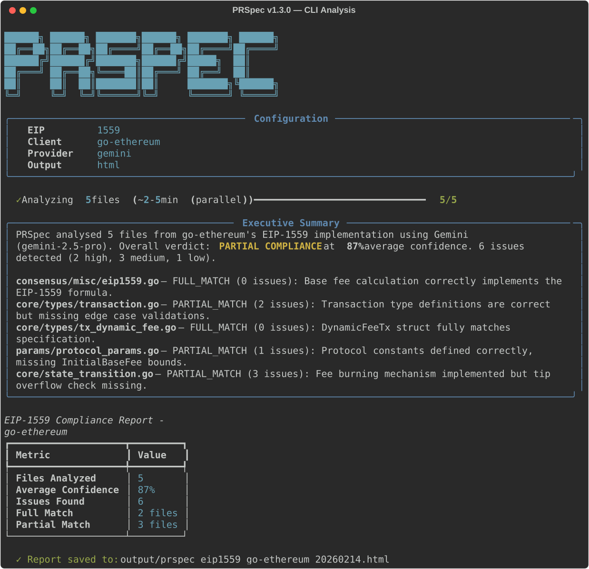
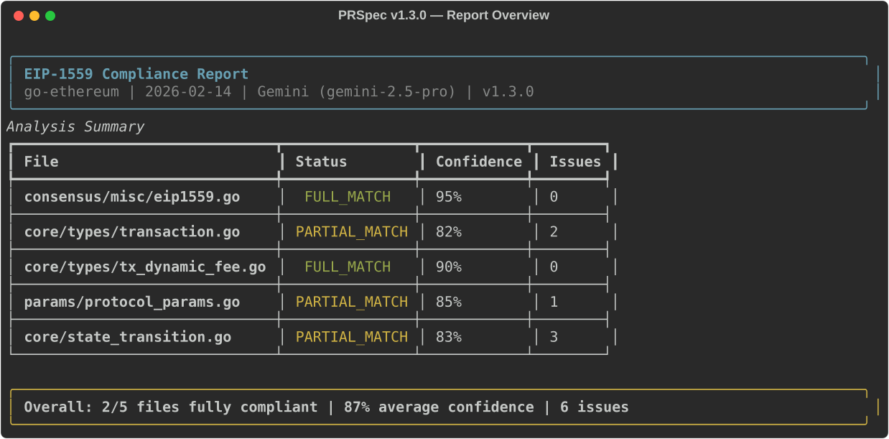
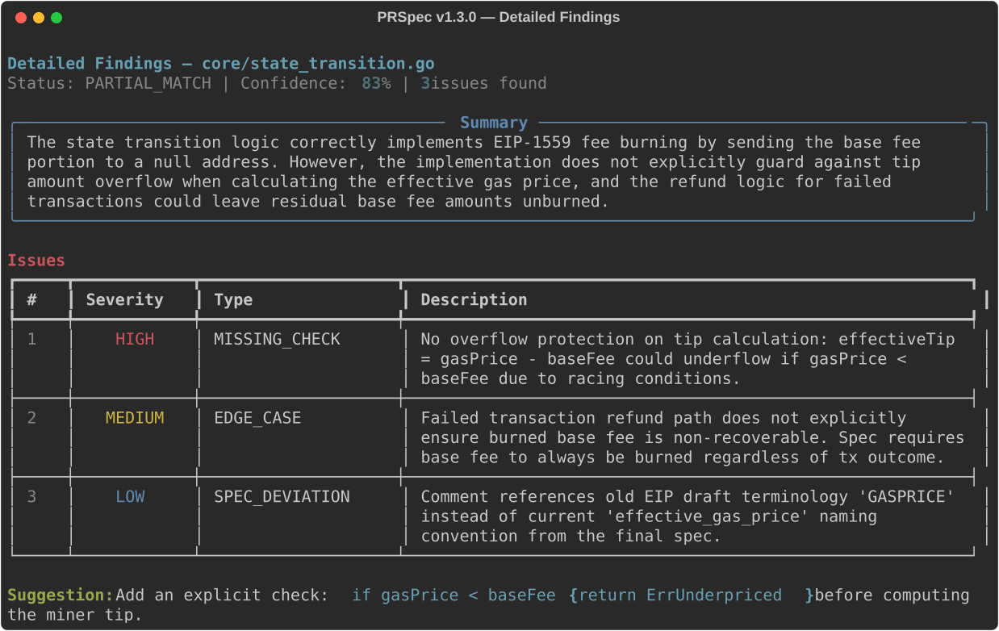
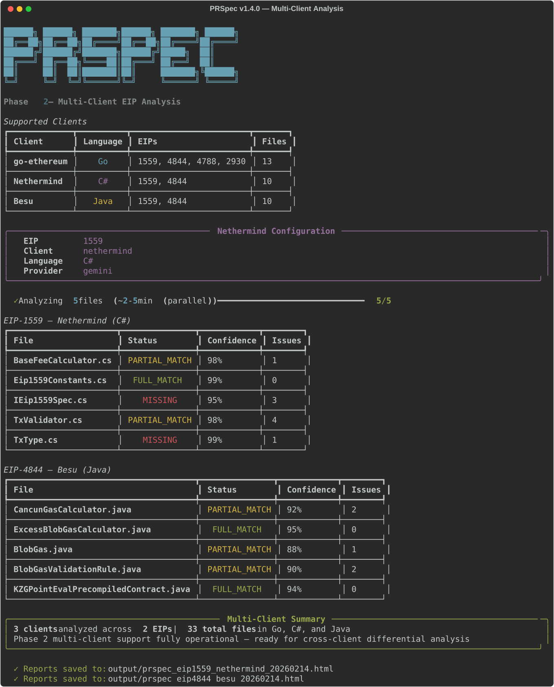

# PRSpec

**Ethereum specification compliance checker:** Compares EIP specs against client source code using LLM analysis.

<div align="center">

[](https://giveth.io/project/prspec-automated-eip-compliance-checker-for-ethereum)
<br>
[](https://www.python.org/downloads/)
[](LICENSE)
[](https://ai.google.dev/)

</div>


---

## What's new in v1.7

This release adds **Reth (Rust) support** and **Pectra EIP coverage** — PRSpec now spans all four major execution clients across all Pectra upgrade EIPs.

- **Reth client support.** PRSpec now analyzes [paradigmxyz/reth](https://github.com/paradigmxyz/reth) in Rust alongside go-ethereum, Nethermind, and Besu.
- **Rust parser.** A new `fn`, `impl`, `struct`, `trait` parser handles Rust source files end-to-end.
- **Pectra EIPs.** Full file mappings for EIP-7702 (Set EOA Account Code), EIP-2935 (Historical Block Hashes), EIP-2537 (BLS12-381 precompiles), and EIP-6110 (Validator Deposits) across all four clients.
- **149 passing tests.** Rust parser correctness, Reth registry validation, Pectra EIP file mappings, branch-aware fetching, and staking-EIP (7002/7251) request-processor mappings.

See the [changelog](#changelog) for the full details.

---

## What PRSpec Does, and Why Nothing Else Does It

Most Ethereum security tooling (Slither, Mythril, Echidna) is designed to catch **bugs in smart contracts** through static analysis, symbolic execution, or fuzzing. They operate entirely within code, with no knowledge of the EIP specifications those clients are supposed to implement.

**PRSpec solves a different and harder problem:** *Does the client implementation actually match what the spec says?*

It fetches official EIP documents, execution specs, and consensus specs directly from the Ethereum repos, pulls the corresponding implementation files from multiple Ethereum clients, and sends both to a large-context LLM (Gemini 2.5 Pro, GPT-4, or a Claude deployment on Azure AI Foundry) to identify deviations, missing checks, and edge cases the spec requires but the code omits. No existing open-source tool does this.

---

## Confirmed Findings From Protocol Teams

These are not hypothetical results. PRSpec has produced findings that have been reviewed and confirmed by core developers at major Ethereum client organizations.

> **Nethermind (C#):** PRSpec flagged `FeeCollector` as a deviation from EIP-1559's mandatory fee burn mechanism. A Nethermind core developer [confirmed the finding](https://github.com/NethermindEth/nethermind/issues/10522) and acknowledged it as a chain-specific extension that "could be refactored better."
> Source: [Issue #10522](https://github.com/NethermindEth/nethermind/issues/10522)

> **Ethereum Foundation execution-specs team:** The EF team [engaged directly with PRSpec's architecture](https://github.com/ethereum/execution-specs/issues/2212#issuecomment-3915461994), providing guidance on using fork-to-fork diffs for EIP boundary detection, a technique now integrated into PRSpec's spec extraction pipeline.
> Source: [Issue #2212](https://github.com/ethereum/execution-specs/issues/2212)

These are publicly verifiable interactions, linked above, with named engineers at the Nethermind and Ethereum Foundation organizations. They demonstrate that the tool is producing technically meaningful output that practitioners take seriously.

> PRSpec is independent, open-source infrastructure for cross-client EIP compliance. It is built and maintained by one developer, and it welcomes sponsors. Organizations that depend on correct client implementations are invited to support the work and be recognized publicly as official backers. See [Support & Sponsorship](#support--sponsorship).

---

## Staking-EIP cross-client coverage

PRSpec now covers the execution-layer EIPs that the staking lifecycle depends on: EIP-7002
(triggerable withdrawals), EIP-7251 (consolidation), EIP-6110 (deposits), and EIP-4788
(beacon block root). These are the code paths underneath validator entry and exit, where
client-level protocol divergence matters most and where almost nothing monitors compliance
continuously.

Running the analysis across go-ethereum, Nethermind, and Besu surfaced a cross-client
divergence in the request system-call path: go-ethereum does not invalidate a block when a
*checked* request predeploy (EIP-7002 / 7251) has no code, where the execution-specs reference,
Nethermind, and Besu all invalidate. Confirmed across two independent EIPs and re-verified by
hand against client source and the reference. Write-up:
[`findings/geth-eip7002-missing-code-invalidation.md`](findings/geth-eip7002-missing-code-invalidation.md).

This is a latent divergence, not a live mainnet split (the predeploys are deployed at fork
activation). It is exactly the class of risk that should be watched continuously rather than
audited once.

---

## Technical Differentiators

| Capability | PRSpec | Slither / Mythril / Echidna |
|---|---|---|
| Checks against EIP specification text | ✅ | ❌ |
| Understands natural-language spec requirements | ✅ (LLM) | ❌ |
| Adversarial verification of each finding | ✅ | ❌ |
| Grounds findings in exact spec text | ✅ | ❌ |
| Cross-client differential analysis | ✅ (go-ethereum, Nethermind, Besu, Reth) | ❌ |
| Multi-language support (Go, C#, Java, Rust) | ✅ | Limited |
| Targets protocol-layer client code | ✅ | Smart contracts |
| Detects spec deviations vs. code bugs | ✅ | ❌ |

The core technical insight is that EIP compliance is a **semantic problem**, not a syntactic one. A base fee calculation can be syntactically correct Go and still deviate from the spec, because the spec is written in English and the deviation is in the logic, not in the syntax. LLMs with large context windows are uniquely suited to bridge this gap.

---

## Verified findings, not raw guesses

The hardest problem with any LLM-based analysis is false positives: a model that
confidently invents a deviation that isn't real. A tool that floods client teams
with plausible-but-wrong findings gets ignored. PRSpec's verification layer exists
to make the opposite trade: fewer findings, each one defensible.

Every candidate finding goes through two independent checks before it is reported:

1. **Adversarial re-examination.** The finding is handed back to the model in a
   fresh, skeptical pass that is told to *refute* it and to prefer "no issue" when
   the evidence is ambiguous. Several independent rounds vote, and the finding is
   graded `CONFIRMED`, `DISPUTED`, or `REFUTED`.
2. **Spec grounding.** The exact text the finding quotes as its `spec_reference`
   must actually appear in the fetched specification. A quote that cannot be
   located in the spec is almost always hallucinated, so the finding can never be
   `CONFIRMED`, no matter how the rounds voted.

Only findings that survive both checks are counted toward the headline numbers.
The grading is shown inline in every report, so a reviewer sees exactly what held
up. Verification is on by default for `analyze`; turn it off with `--no-verify`.

```bash
python -m src.cli analyze --eip 1559 --client nethermind --verify --output html
```

PRSpec also feeds the analyzer the **fork-to-fork execution-spec diff** rather than
the whole `fork.py`: it diffs the implementing fork against its predecessor (e.g.
`london` against `berlin`) so the model sees the EIP's precise delta. This is the
fork-to-fork technique the execution-specs maintainers recommend for EIP boundary
detection, and it sharpens the analysis enough to cut noise-driven false positives
on its own.

---

## Screenshots

### CLI Analysis


### Report Overview


### Detailed Findings


### Multi-Client Analysis (Phase 2)


---

## Demo Video
### Video ▶️ [Watch on Youtube](https://www.youtube.com/watch?v=v7UtBAxigKc)
### Version 1.3 Terminal Video Demo ▶️ [Watch on ASCiinema](https://asciinema.org/a/FSqTk0tKOx8TFiQu)

---

## Supported EIPs & Clients

### Clients

| Client | Language | EIPs supported | Repo |
|--------|----------|---------------|------|
| go-ethereum | Go | 1559, 4844, 4788, 2930, 7702, 2935, 2537, 6110, 7002, 7251 | [ethereum/go-ethereum](https://github.com/ethereum/go-ethereum) |
| Nethermind | C# | 1559, 4844, 4788, 7702, 2935, 2537, 6110, 7002, 7251 | [NethermindEth/nethermind](https://github.com/NethermindEth/nethermind) |
| Besu | Java | 1559, 4844, 4788, 7702, 2935, 2537, 6110, 7002, 7251 | [hyperledger/besu](https://github.com/hyperledger/besu) |
| Reth | Rust | 1559, 4844, 7702, 2935, 2537, 7002, 7251 | [paradigmxyz/reth](https://github.com/paradigmxyz/reth) |

### EIPs

| EIP | Title | Specs fetched | Files per client | Key focus areas |
|-----|-------|---------------|------------------|-----------------|
| 1559 | Fee market change | EIP + execution | geth 5 · nethermind 6 · besu 5 · reth 4 | base fee, gas limit, fee cap, state transition |
| 4844 | Shard Blob Transactions | EIP + execution + consensus | geth 5 · nethermind 5 · besu 5 · reth 4 | blob gas, KZG, max blobs, sidecar, tx pool |
| 4788 | Beacon block root in EVM | EIP + execution | geth 2 · nethermind 1 · besu 2 | beacon root system call, missing-code handling (unchecked class) |
| 2930 | Optional access lists | EIP + execution | geth 2 | access list validation |
| **7002** | **Execution layer withdrawals** | EIP + execution | geth 2 · nethermind 2 · besu 3 | withdrawal request predeploy, missing-code invalidation (checked class) |
| **7251** | **Increase MAX_EFFECTIVE_BALANCE** | EIP + execution + consensus | geth 2 · nethermind 2 · besu 3 · reth 2 | consolidation request, missing-code invalidation (checked class) |
| **7702** | **Set EOA Account Code** | EIP + execution | geth 5 · nethermind 5 · besu 5 · reth 4 | authorization tuple, delegation designator, nonce, chain ID |
| **2935** | **Historical Block Hashes** | EIP + execution | geth 3 · nethermind 3 · besu 2 · reth 2 | ring buffer, system contract, blockhash opcode |
| **2537** | **BLS12-381 Precompiles** | EIP + execution | geth 3 · nethermind 3 · besu 3 · reth 2 | G1/G2 ops, gas costs, subgroup checks |
| **6110** | **Validator Deposits on Chain** | EIP + execution | geth 3 · nethermind 2 · besu 2 | deposit log parsing, max deposits, block body |

Run `python -m src.cli list-eips` to see the live registry.

---

## Quick start

```bash
# clone and set up
git clone https://github.com/Fosurero/PRSpec.git
cd PRSpec
python -m venv venv && source venv/bin/activate
pip install -r requirements.txt

# add your API key
cp .env.example .env
# edit .env → GEMINI_API_KEY=your_key_here

# run the demo
python run_demo.py              # EIP-1559 by default
python run_demo.py --eip 4844   # EIP-4844
python run_demo.py --test       # quick API check
```

Get a Gemini key at https://aistudio.google.com/app/apikey

---

## CLI usage

```bash
# full analysis → produces JSON/Markdown/HTML reports
python -m src.cli analyze --eip 1559 --client go-ethereum --output html

# analyze Nethermind (C#) or Besu (Java) instead
python -m src.cli analyze --eip 1559 --client nethermind --output html
python -m src.cli analyze --eip 4844 --client besu --output html

# verification is on by default; tune the rounds or turn it off
python -m src.cli analyze --eip 1559 --client nethermind --verify-rounds 3
python -m src.cli analyze --eip 1559 --client go-ethereum --no-verify

# cross-client differential: compare how clients implement the same EIP
python -m src.cli diff --eip 1559 --output html
python -m src.cli diff --eip 4844 --clients go-ethereum,nethermind,besu --output html

# other commands
python -m src.cli fetch-spec --eip 4844
python -m src.cli list-files --client go-ethereum --eip 4844
python -m src.cli list-eips
python -m src.cli check-config
```

### Cross-client differential analysis

The `diff` command runs the standard analysis for each client, then builds a
comparison matrix showing, per dimension (overall status, issue types, and
each EIP focus area), where the implementations **agree** and where they
**diverge**. With no `--clients` flag it compares every client that has file
mappings for the EIP.

```bash
python -m src.cli diff --eip 1559                       # all clients with 1559 mappings
python -m src.cli diff --eip 4844 --llm-synthesis       # add an LLM divergence narrative
```

Reports land in `output/` as `prspec_diff_eip<N>_<timestamp>.{json,md,html}`.

---

## Configuration

### config.yaml

```yaml
llm:
  provider: gemini

  gemini:
    model: gemini-2.5-pro
    max_output_tokens: 8192
    temperature: 0.1

  openai:
    model: gpt-4-turbo-preview
    max_tokens: 4096
    temperature: 0.1

eips:
  1559:
    focus_areas:
      - base_fee_calculation
      - gas_limit_validation
      - fee_cap_check
  4844:
    focus_areas:
      - blob_gas_price
      - kzg_commitment
      - max_blobs_per_block
      - sidecar_validation
```

### Environment variables

| Variable | Required | Description |
|----------|----------|-------------|
| `GEMINI_API_KEY` | Yes (Gemini) | Google AI Studio API key |
| `OPENAI_API_KEY` | Yes (OpenAI) | OpenAI API key |
| `AZURE_AI_API_KEY` | Yes (Azure) | Key for a model deployed in your Azure AI Foundry resource |
| `AZURE_AI_ENDPOINT` | Yes (Azure) | Foundry Anthropic Messages URL (`.../anthropic/v1/messages`) |
| `AZURE_AI_DEPLOYMENT` | Yes (Azure) | Deployment name (acts as the model id) |
| `GITHUB_TOKEN` | No | Higher GitHub rate limits |
| `LLM_PROVIDER` | No | Override default provider (`gemini`, `openai`, or `azure`) |

---

## Project layout

```
src/
  config.py            – YAML + env config loader
  spec_fetcher.py      – EIP registry, spec fetching (EIP/execution/consensus)
  code_fetcher.py      – Per-client per-EIP file registry, code fetching
  parser.py            – Go/Python/C#/Java/Rust parsing, EIP keyword matching
  analyzer.py          – Gemini / OpenAI / Azure AI analysis, JSON response parsing
  verifier.py          – Adversarial finding verification + spec grounding
  differential.py      – Cross-client differential engine + comparison matrix
  report_generator.py  – JSON, Markdown, HTML report output (single + differential)
  cli.py               – Click CLI
  engine/              – Library API for programmatic scanning
tests/
  test_eip1559.py
  test_eip4844.py
  test_multi_client.py – All 4 client registries + C#/Java/Rust parser tests
  test_differential.py – Cross-client differential engine tests
  test_verifier.py     – Verification engine + spec grounding tests
  test_spec_diff.py    – Fork-to-fork spec diff extraction tests
  test_azure_analyzer.py – Azure AI Foundry provider tests
config.yaml
pyproject.toml         – Package metadata, dependencies, linter config
run_demo.py
CONTRIBUTING.md
SECURITY.md
LICENSE
```

---

## Example output

```json
{
  "status": "PARTIAL_MATCH",
  "confidence": 85,
  "issues": [
    {
      "type": "EDGE_CASE",
      "severity": "MEDIUM",
      "description": "Edge case when gas used equals target not explicitly handled",
      "suggestion": "Add explicit equality check"
    }
  ],
  "summary": "Implementation mostly compliant with minor edge case gaps."
}
```

Reports are written to the `output/` directory in all three formats (JSON, Markdown, HTML).

---

## Running tests

```bash
python -m pytest tests/ -v

# with coverage
python -m pytest tests/ --cov=src
```

The test suite covers 385 cases (96% statement coverage of `src/`) including multi-client registry validation (all 4 clients), Go/C#/Java/Rust/Python parser correctness, cross-client differential comparison, finding verification and spec grounding, fork-to-fork diff extraction, staking-EIP request-processor mappings, provider wiring, configuration and env-var precedence, report rendering in all three formats, the CLI commands end to end, and live fetch integration.

---

## API usage

```python
from src.config import Config
from src.analyzer import GeminiAnalyzer
from src.spec_fetcher import SpecFetcher
from src.code_fetcher import CodeFetcher

config = Config()
analyzer = GeminiAnalyzer(api_key=config.gemini_api_key)

spec_fetcher = SpecFetcher()
code_fetcher = CodeFetcher()

spec = spec_fetcher.fetch_eip_spec(4844)
files = code_fetcher.fetch_eip_implementation("go-ethereum", 4844)

result = analyzer.analyze_compliance(
    spec_text=spec["eip_markdown"],
    code_text=files["core/types/tx_blob.go"],
    context={"eip_number": 4844, "language": "go"},
)

print(result.status, result.confidence)
for issue in result.issues:
    print(f"  [{issue['severity']}] {issue['description']}")
```

---

## Library API (Engine)

PRSpec can also be used as a Python library for programmatic scanning. The engine module discovers source files and identifies EIP-relevant code blocks without requiring LLM API keys.

```python
from src.engine import scan_path

result = scan_path("path/to/client/source", ruleset="ethereum")

print(f"Scanned {result['summary']['files_scanned']} files")
print(f"Found {len(result['findings'])} EIP-relevant code blocks")

for finding in result["findings"]:
    print(f"  [{finding['severity']}] {finding['title']}")
    print(f"    {finding['file']}:{finding['line']}: {finding['message']}")
```

The returned dict has the structure:

```json
{
  "tool": "PRSpec",
  "tool_version": "1.5.0",
  "ruleset": "ethereum",
  "findings": [{"id", "severity", "title", "message", "file", "line", "hint"}],
  "summary": {"high": 0, "med": 0, "low": 0, "info": 5, "files_scanned": 12}
}
```

### Differential API

Compare multiple clients programmatically and inspect the comparison matrix:

```python
from src.config import Config
from src.differential import analyze_clients

diff = analyze_clients(1559, ["go-ethereum", "nethermind", "besu"], Config())

print(diff.narrative)
print(f"{diff.divergence_count} diverging / {diff.agreement_count} agreeing dimensions")

for row in diff.rows:
    if row.verdict == "DIVERGE":
        print(f"  {row.dimension}: {row.per_client}")
```

---

## Contributing

Contributions are welcome. See [CONTRIBUTING.md](CONTRIBUTING.md) for guidelines on:
- Adding new EIP file mappings
- Adding new client support (Prysm, Lighthouse, etc.)
- Parser improvements for additional languages
- Report enhancements

---

## Security

PRSpec is a security research tool. See [SECURITY.md](SECURITY.md) for:
- Vulnerability reporting process
- API key handling
- Data handling policies
- LLM provider trust considerations

---

## Changelog

### v1.7.1 (2026-06-30)
- **Staking-EIP coverage**: EIP-7002 (triggerable withdrawals) and EIP-7251 (consolidation) file mappings across go-ethereum, Nethermind, Besu, and Reth; EIP-4788 mappings extended to Nethermind and Besu; geth EIP-4788/6110 mappings corrected to the real processing paths
- **Finding**: confirmed cross-client divergence in the request system-call path (geth accepts a block with a missing checked-request predeploy where the reference, Nethermind, and Besu invalidate), corroborated across EIP-7002 and EIP-7251
- **Fix**: updated execution-specs fetch paths for the upstream `src/ethereum/forks/<fork>/` restructure (fork-to-fork spec diffs were silently failing)
- 4 new tests (149 passing total)

### v1.7.0 (2026-06-26)
- **Reth (Rust) client support**: PRSpec now analyzes [paradigmxyz/reth](https://github.com/paradigmxyz/reth) alongside go-ethereum, Nethermind, and Besu — Rust parser with `fn`, `impl`, `struct`, and `trait` extraction added to `CodeParser`
- **Pectra EIP coverage**: full file mappings for EIP-7702 (Set EOA Account Code), EIP-2935 (Historical Block Hashes), EIP-2537 (BLS12-381 precompiles), and EIP-6110 (Validator Deposits) across all four clients
- Focus areas for each Pectra EIP defined in `config.yaml` (authorization tuple validation, delegation designator prefix, ring buffer index, subgroup membership checks, etc.)
- 20 new tests: Rust parser correctness, Reth registry validation, Pectra EIP file mapping coverage, branch-aware fetching for non-master repos
- Registry now spans 10 EIPs × 4 clients (145 tests passing total)

### v1.6.0 (2026-06-25)
- **Verified findings**: every candidate finding is now adversarially re-examined (independent skeptic rounds vote `CONFIRMED`/`DISPUTED`/`REFUTED`) and grounded against the exact specification text, collapsing the false-positive rate. Verification is on by default for `analyze` (`--no-verify` to skip, `--verify-rounds` to tune)
- `DifferentialEngine` and reports can restrict stats to confirmed-only findings
- **Fork-to-fork spec diffs**: the analyzer is fed the execution-spec delta between the implementing fork and its predecessor (e.g. `london` vs `berlin`) instead of the whole `fork.py`, focusing the comparison on the EIP boundary
- New `src.verifier` library API (`VerificationEngine`, `SpecGrounding`); `SpecFetcher.fetch_execution_spec_diff`
- **Azure AI Foundry provider**: point PRSpec at a Claude (or any) deployment in your own Foundry resource via `LLM_PROVIDER=azure` and the `AZURE_AI_*` variables; useful when you want a stronger reasoning model for the verification passes
- 31 new tests covering grounding, verdict tallying, diff extraction, and the Azure provider (125 passing total)

### v1.5.0 (2026-06-08)
- **Cross-client differential analysis (Phase 3)**: new `prspec diff` command compares how multiple clients implement the same EIP and produces an agree/diverge comparison matrix
- `DifferentialEngine`: deterministic comparison across overall status, issue types, and EIP focus areas (no API key required)
- Optional `--llm-synthesis` pass for a natural-language divergence narrative
- Differential reports in JSON, Markdown, and HTML
- New `src.differential` library API (`analyze_clients`, `DifferentialEngine`)
- 18 new tests covering the differential engine

### v1.4.0 (2026-02-14)
- **Multi-client support**: Nethermind (C#) and Besu (Java) alongside go-ethereum (Go)
- EIP-1559 and EIP-4844 file mappings for all three clients (5 files each)
- C# and Java regex parsers with class + method extraction
- 25 new tests covering registry, parsers, and fetch integration
- Keyword matching verified language-agnostic (case-insensitive)

### v1.3.0 (2026-02-06)
- Parallel analysis: all files analyzed concurrently via thread pool, ~3x faster on multi-file EIPs
- Expanded file coverage: EIP-1559 and EIP-4844 now analyze 5 files each (added `state_transition.go`, `protocol_params.go`, `legacypool.go`)
- Beautified CLI: progress bar with file counter, styled config panel
- Migrated to `google-genai` SDK (replaces deprecated `google-generativeai`)
- Executive summary paragraph at the top of every report

### v1.1.0 (2026-02-01)
- Multi-EIP architecture: registry-based spec and code fetching
- Added EIP-4844, EIP-4788, EIP-2930 support
- HTML report with dark-nav professional layout
- Comprehensive test suite (37 tests)

### v1.0.0 (2026-01-22)
- Initial release: EIP-1559 analysis against go-ethereum
- Gemini and OpenAI support, JSON/Markdown/HTML output

---

## Roadmap

| Phase | Description | Status |
|-------|-------------|--------|
| 1 | Multi-EIP architecture, EIP-4844 support | ✅ Done |
| 2 | Multi-client analysis (Nethermind, Besu) | ✅ Done |
| 3 | Cross-client differential analysis | ✅ Done |
| 3.5 | Verified findings: adversarial verification + spec grounding + fork-to-fork diffs | ✅ Done |
| 3.6 | Reth (Rust) client support + Pectra EIP coverage (7702, 2935, 2537, 6110) | ✅ Done |
| 4 | GitHub Action CI integration, security dashboard | 🔄 In progress |
| 5 | Spec quality analysis: flag underspecified EIPs | 🔍 Exploring |

---

## Support & Sponsorship

PRSpec is built entirely in the open and provided free under the MIT license. It is the work of one developer who believes cross-client spec compliance deserves serious, continuous tooling.

**Sponsors are welcome.** If your protocol, client team, or organization depends on execution clients implementing the EIPs correctly, you have a direct stake in this work. Sponsorship funds staking-EIP coverage, monthly cross-client compliance reports, and priority alerts on protocol-path deviations. Everything stays open-source, and **official sponsors are recognized publicly here in the README and project page**. Tiered backing and scoped pilots are both fine.

To sponsor or discuss support, reach out through the project page, or contribute directly:

[](https://giveth.io/project/prspec-automated-eip-compliance-checker-for-ethereum)

Every contribution goes directly toward LLM API costs, infrastructure, and continued full-time development.

---

## License

MIT. [Fosurero/PRSpec](https://github.com/Fosurero/PRSpec)
